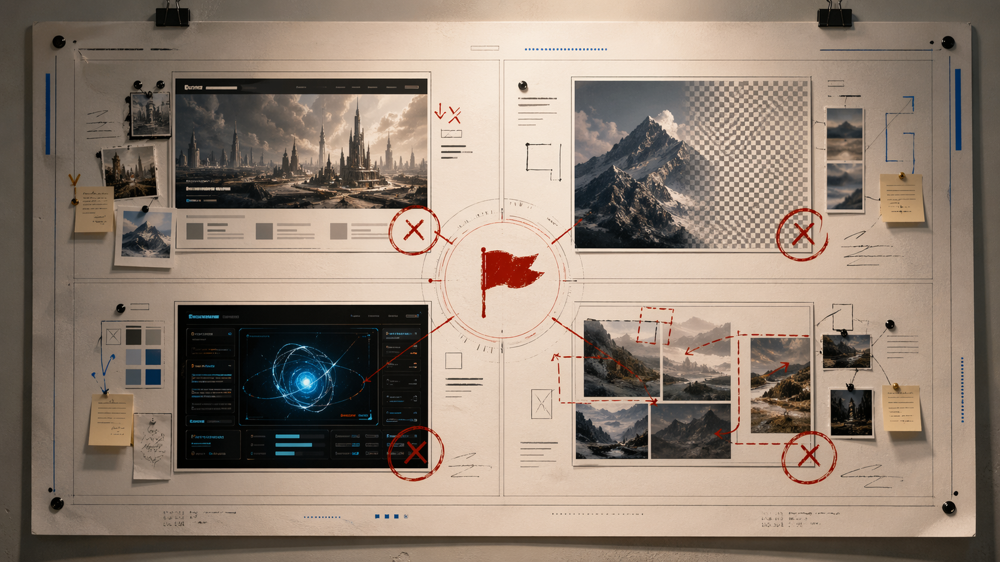
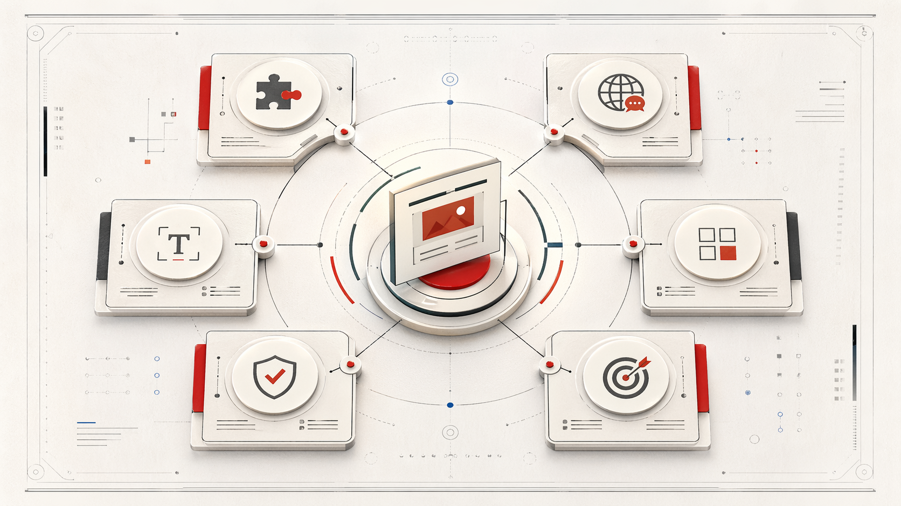
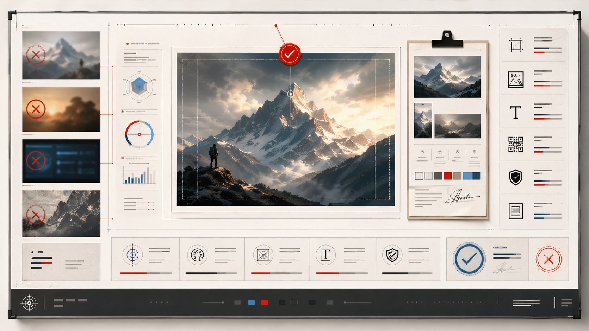
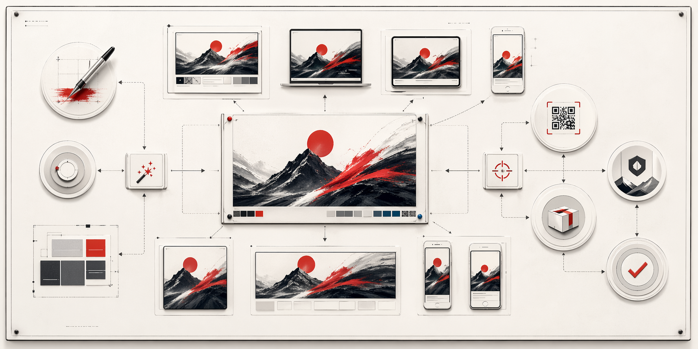

# image2-design-director

给具备图像生成能力的 Agent 加上一层“设计导演判断层”，让结果更接近真实用户会采用的图像成品，而不只是“能出图”。

[Skill 入口](./SKILL.md) · [文档导航](./docs/README.md) · [首页图片方案](./docs/readme-image-story-homepage-plan-2026-04-23.md) · [出图 Prompt 包](./docs/readme-image-story-prompts/readme-homepage-image-suite-v1.md) · [目标架构](./docs/target-skill-architecture.md) · [运行时记忆](./references/runtime-memory.md)


不是让 agent 更会出图，而是先让它做对图。

图像生成 Agent 原本常见的问题不是不会写提示词，而是缺少一层更稳定的判断：什么时候该直接生成，什么时候该先补关键信息，什么时候该只做最小修正，什么时候其实是前面对需求理解错了。`image2-design-director` 补上的，就是这层分阶段判断、质量把关和经验复利机制。

兼容思路上，这个仓库优先面向支持 `SKILL.md` 工作流、且具备图像生成能力的 Agent 运行环境。协议层可迁移，但不同宿主对触发、安装、运行时路径和 UI 元数据的支持程度应按各自实现判断，不应自动视为已验证。它不绑定单一宿主，仓库规则层和本地运行时经验层也被明确分开。



## 普通生图为什么会跑偏

大多数失败不是“模型不会生成”，而是系统过早开始优化，却还没确认要交付的到底是什么资产。常见跑偏方式包括：

- 资产类型错了
- 成品度错了
- 语言策略错了
- 该重建理解时却只做局部修补



## 先收 Asset Contract，再决定怎么生成

这个 skill 的第一职责不是立刻扩写 prompt，而是先确认交付物合同。每次任务开始时，至少先收清：

- 最终资产是什么
- 这是完整成品还是底图
- 默认文案语言是什么
- 图里允许出现哪些文字
- 谁负责最终排版
- 怎样才算用户可验收


## 同一个任务，不一定走同一条路

根据合同清晰度和任务状态，系统会在不同路径之间分流：

- `direct`
- `brief-first`
- `repair`
- `contract_realign`

它不是一把梭地反复重试，而是先判断这轮到底该怎么跑。



## 判断标准不是“好不好看”

真正的验收问题是：

- 这是不是用户要的那类资产
- 现在是不是可直接使用的完成状态
- 文案语言和文字策略是否一致
- 输出是否仍在原始合同边界之内

如果结果没过线，就不会假装完成，而是进入修正。



## 一张图过线后，才值得进入交付推进

`image2-design-director` 不只负责生成一张图，还会把过线结果继续推进成真正可交付资产，例如：

- 多尺寸版本
- 文案细化
- 二维码与 logo 落位
- 发版级资产整理

## 它适合什么

这个 skill 主要面向“设计可用性要求较高”的图像任务，尤其适合海报、品牌图、产品图、UI 视觉图、README hero、社媒图，以及已有结果明显跑偏后的修正场景。

它适合：

- 海报、宣传图、品牌图、公开发布图
- 社交媒体配图、封面图、信息流创意图
- 产品图、商品图、设备主视觉、产品样机图
- UI、UX、应用界面、数据看板、设计系统视觉图
- 插画、场景图、概念图、引导页视觉图
- 带参考图改造、带尺寸限制、多候选抽卡的图片任务
- 已有图像不符合预期后的定向修正

如果一个 Agent 正准备处理高设计可用性要求、交付物合同容易跑偏、或已有结果需要定向纠偏的图像任务，默认就应该先调用 `$image2-design-director`。

## 它和普通“提示词增强器”的区别

- 它不是只把一句话扩写得更长，而是先判断任务该怎么推进
- 它关注的是“这是不是用户真正要的那张图”，不是只关注提示词表面工艺
- 它会区分直接生成、补需求、小修和重建理解，而不是一把梭地不断重试
- 它会区分成品、底图和交付阶段，而不是把所有输出都视为同一种结果
- 它把失败样本和纠偏规则当成一等公民，而不是只收集成功模板

## 快速开始

### 1. 安装到你的 skill 目录

目前这个仓库主要提供手动接入方式。最简单的是把整个仓库 clone 到你的 agent skills 目录：

```bash
git clone https://github.com/boyzcl/image2-design-director.git "$AGENT_SKILLS_HOME/image2-design-director"
```

如果你的运行环境没有统一的 `AGENT_SKILLS_HOME`，也可以直接把仓库放到该宿主实际读取 skill 的目录里，或把 `SKILL.md`、`references/`、`patterns/`、`scripts/` vendoring 到现有系统。

### 2. 先读核心入口

第一次使用，建议按这个顺序：

1. [SKILL.md](./SKILL.md)
2. [docs/README.md](./docs/README.md)
3. [首页图片方案](./docs/readme-image-story-homepage-plan-2026-04-23.md)
4. [出图 Prompt 包](./docs/readme-image-story-prompts/readme-homepage-image-suite-v1.md)
5. `references/` 下的核心协议文档

### 2.5 调用方式

显式调用时，直接使用：

```text
$image2-design-director
```

也支持自然语言直接触发，只要你的 Agent 宿主会读取 `SKILL.md` 并按技能描述进行路由。

### 3. 可选启用运行时记忆

如果你只想使用规则层，直接读 skill 即可。

如果你想启用本地经验沉淀，再配置运行时根目录，并使用脚本：

```bash
python scripts/init_runtime_memory.py --host generic
python scripts/read_runtime_context.py --host generic --raw-only
```

运行时也可以通过 `IMAGE2_DESIGN_DIRECTOR_RUNTIME_ROOT` 显式指定本地运行时根目录。详情见 [references/runtime-memory.md](./references/runtime-memory.md)。

## 仓库结构

- [SKILL.md](./SKILL.md): skill 主入口与默认工作流
- [assets/readme-story/](./assets/readme-story): README 首页图片资产
- [references/](./references): 对外可复用的协议、策略、质量标准和运行规则
- [patterns/](./patterns): 可迁移的 pattern 模板
- [scripts/](./scripts): 运行时、交付和治理脚本
- [docs/README.md](./docs/README.md): 文档导航，区分 public-facing 与 maintainer / historical 内容
- [agents/openai.yaml](./agents/openai.yaml): 最小 interface 示例

## 核心文档

- [提示词结构](./references/prompt-schema.md)
- [提示词装配](./references/prompt-assembly.md)
- [Task Packet](./references/task-packet.md)
- [Quality Bar](./references/quality-bar.md)
- [Scorecard](./references/scorecard.md)
- [运行时记忆](./references/runtime-memory.md)
- [Delivery Ops](./references/delivery-ops.md)

## 验证与证据

这个仓库保留了 benchmark 和 experiment 文档，作为历史验证材料，而不是公开仓库首页的主叙事。

可以从这些入口继续看：

- [docs/benchmarks/](./docs/benchmarks)
- [docs/experiments/](./docs/experiments)
- [Status Summary](./docs/status-summary-2026-04-22.md)
- [Stage Progress Review](./docs/stage-progress-review-2026-04-22.md)
- [Release Readiness Review](./docs/release-readiness-review-2026-04-23.md)

## 当前边界

- 本地自动晋升只作用于本地运行时 / 本地 skill 参考层
- repo 规则更新和 GitHub promotion 仍然是人工 review 边界
- 运行时数据、状态目录、生成图片、测试输出默认不进入公开仓库
- 这个仓库提供的是“设计导演协议层”和辅助脚本，不替代具体图像模型本身

## 适合先看什么

- 第一次了解项目：看本页和 [docs/README.md](./docs/README.md)
- 直接使用 skill：看 [SKILL.md](./SKILL.md)
- 想理解协议层：从 `references/` 开始
- 想看历史验证：再进入 `docs/benchmarks/` 与 `docs/experiments/`
- 想继续维护和扩展：看 maintainer / historical docs
