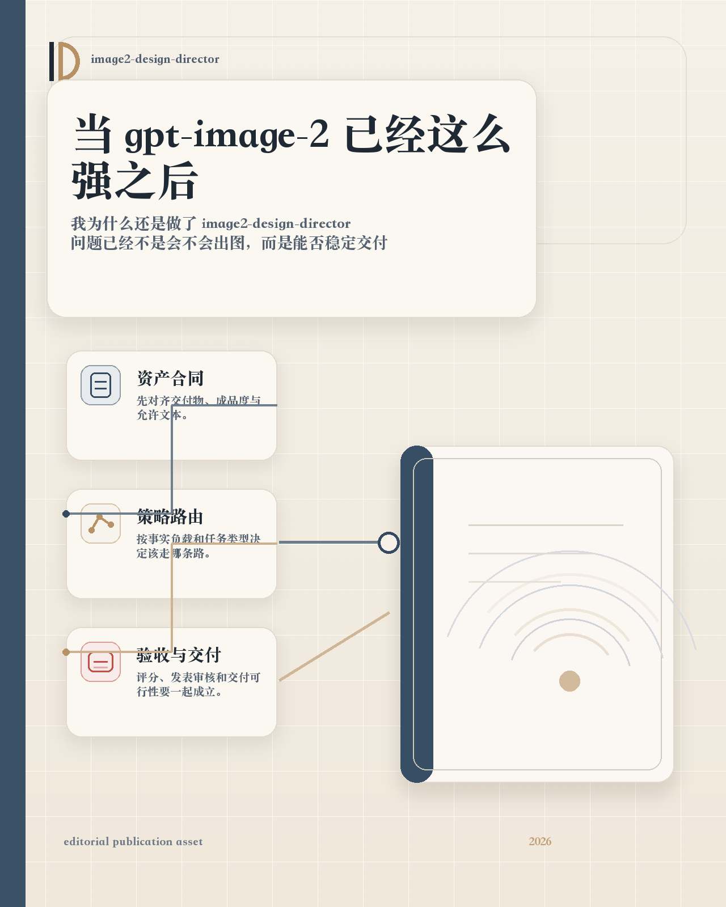
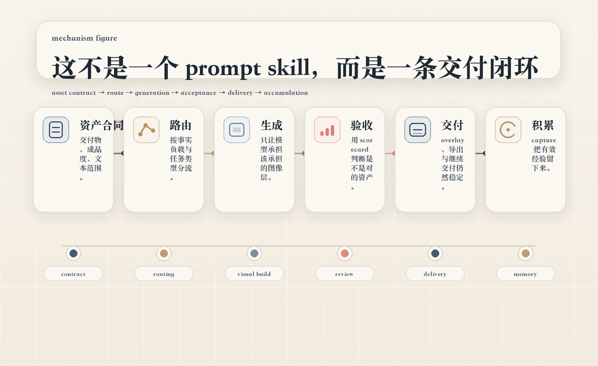
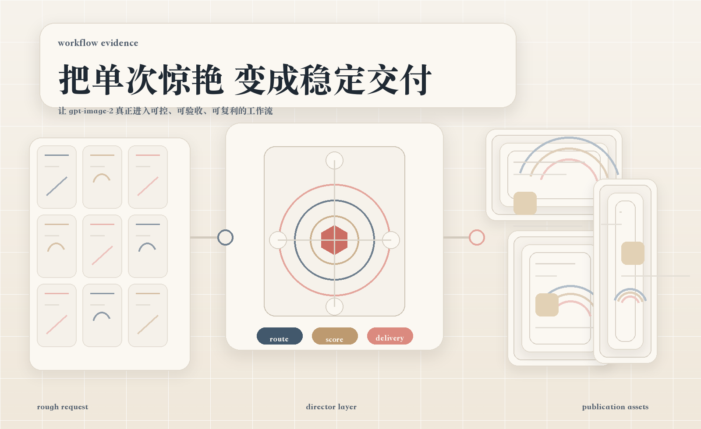

# 我为什么还是做了 `image2-design-director`，当 `gpt-image-2` 已经这么强之后

前段时间我第一次认真上手 `gpt-image-2` 的时候，是真的有点被震住了。

我先把一个前提讲清楚，我做这个 skill，不是因为我觉得这个模型不行。恰恰相反，是因为我觉得它太行了。它的强，不只是画质更好了、构图更稳了、风格更像样了，而是它开始更像一个会理解任务的系统。它会利用更多背景知识，理解你的语境，补全你没说透但你其实想要的东西，再把这些信息组装成视觉结果。

OpenAI 这一轮官方反复强调的几件事，我觉得都很关键，世界知识更强，instruction following 更强，contextual awareness 更强，dense text、多语言、复杂信息资产的处理能力更强。到了 ChatGPT Images 2.0 对应的 thinking mode，它甚至可以把研究、推理、工具使用一起带进图像生成过程。

也正因为这样，我后来越来越确定，真正值得被单独命名的问题，已经不是它会不会出图，而是我们怎么把它的强，变成一条稳定的图像工作流。

*图 1，这张图承担的是文章头图角色。它现在是成品图，不再只是 masthead-safe 中间稿。它要传达的也不是模型会不会画，而是这件事已经不只是 prompt 技巧，而是一套更完整的 editorial collateral。*

## 真正的问题，不是它做不到

如果今天的 `gpt-image-2` 还是过去那种只能偶尔撞到一张好图的模型，我反而不会去做 `image2-design-director`。

真正让我动手的原因，是我发现它**单次能做到很多事情**。它能理解品牌语境，能组织更复杂的信息，能做出更像真实资产的版式，能在很多场景下给出让人惊叹的结果。

但我很快又发现，**单次能做到**，和**工程化出图**，是两回事。

单次能做到，指的是你给它一个请求，它有机会在某一轮里做出非常好的结果。

工程化出图不是这样。工程化出图要解决的，是你把它嵌进 Agent、嵌进 Codex、嵌进真实执行流以后，它能不能一轮又一轮地稳定做对。这里面的重点不是上限，而是稳定性。不是惊艳一次，而是可重复。不是你坐在对话框前慢慢试，而是它进入工作流之后，还能不能持续交付符合预期的资产。

这就是我后来越来越强烈的感受，`gpt-image-2` 越强，这个矛盾越明显。因为它越有能力主动补全、主动理解、主动往前想，单轮结果就越可能惊艳你。可如果没有一层额外的工作流控制，它也越可能沿着一个很聪明、但不一定沿着你交付路径的方向去想。

换句话说，它可能想得很好，但想的不是你这条工作流当前最需要的那种好。

## 我真正卡住的，是工作流

这件事我是在把它放进 Codex 以后感受最深的。

Codex 当然可以调起生图，当然也可以把图片生成接进更大的执行流里。但工作流不会自动长出图像资产判断能力。你今天让它做品牌发布图，明天让它做 README hero，后天让它做需要二维码、固定元素、后置替换、跨尺寸复用的视觉资产，这些任务在系统里看起来都叫生成图片，实际上根本不是同一种任务。

有些任务要完整成品。

有些任务要底图。

有些任务要保留后置空间。

有些任务核心是视觉说服力。

有些任务核心是信息可信度。

有些任务适合让模型直接完成。

有些任务如果继续赌模型一次性完成，风险会非常高。

如果没有一层专门的系统去判断这些差异，Agent 就算接上了最强的 image model，也还是会在真实执行里反复跑偏。

## 所以我后来不再把它理解成一个 prompt 问题

如果问题只是 prompt 不够长、不够细、不够会写，那做一个 prompt enhancer 就够了。

但我后来越来越确定，这件事不是 prompt 问题，而是**组织问题**。

市面上和它相邻的能力，我大概会分成几类来看：

- `prompt rewrite`
- `style / character / composition reference`
- `brand / template / layout consistency`
- `variation / batch extension`
- `editable delivery`

这些能力都重要，而且说实话，`gpt-image-2` 本身已经把其中不少事情往前推了很大一步。尤其是 instruction following、文字处理、真实世界细节理解、复杂资产组织能力，这一轮进步真的很明显。

但问题也在这里，市场上大多数方案优化的仍然是**单点**。单点当然能很强，可单点不会自动变成闭环。

我后来给 `image2-design-director` 找到的位置，也就越来越清楚了。它不是去替代 `gpt-image-2`，也不是拿一个更聪明的 prompt 去跟 `gpt-image-2` 比高下。它做的事情更像是，把 `gpt-image-2` 这类已经很强的模型，真正嵌进一条可持续的图像工作流里。

换句话说，模型负责能力上限，skill 负责把能力上限组织成稳定交付。

## 这个 skill 独特的地方，不是更会写 prompt，而是闭环

我后来越来越喜欢用一句话来描述它，`设计导演判断层 + 可交付闭环层 + 经验复利层`。

这三层缺一不可。

### 第一层，先锁 `asset contract`

先判断最终交付物到底是什么。

这是完整成品，还是底图，还是 delivery refinement。

默认文案语言是什么。

允许出现哪些文字。

版式归谁管，模型、后处理，还是 hybrid。

怎样才算验收通过。

这一步看起来很基础，但其实特别关键。因为模型再强，也不可能替你定义清楚工作流要交付的到底是什么资产。

### 第二层，再决定 route 和 representation

这一步不是简单地问，要不要后处理，而是先问，这张图里哪些内容会被用户当成事实，哪些只是视觉表达。需要精确承载的东西，到底该由模型承担，还是该由确定性系统承担。

所以仓库里后来把这几个东西都显式化了：

- `information reliability gate`
- `representation strategy`
- `direct / brief-first / repair / contract_realign`

低事实负载的品牌图，可以大胆走 `model_direct_visual`。

有限文字、有限标题的 feature visual，可以走 `model_visual_with_limited_text`。

需要二维码、logo、badge、CTA、后续替换和多尺寸复用的，更适合 `visual_base_plus_post`。

高事实敏感、带精确数值和时间口径的，则优先进入 `hybrid_visual_plus_deterministic_overlay`。

这一步不是在削弱模型，反而是在尊重模型。因为强模型最怕的一件事，就是我们把所有任务混成一种任务，再让它硬扛。

*图 2，这张图承担机制图角色。它表达的不是某个具体 campaign，而是从 rough request 到 route、score、assembly、final asset 的系统结构。*

### 第三层，不只生成，还要验收和交付

以前很多图像任务的验收特别虚，好看、有设计感、惊艳。

这些当然重要，但对真实资产来说不够。

所以现在这套 skill 里，验收至少会同时看这些东西：

- `asset_type_fidelity`
- `information_reliability`
- `representation_fit`
- `delivery_integrity`
- `misleading_risk`

也就是说，它不只问像不像好图，还问是不是对的资产，信息是否可信，表达机制是否匹配，交付后还能不能继续用。

如果还要继续加标题、加二维码、加 badge、补日期、出多个尺寸，它还要再过一层 `delivery viability gate`。这个 gate 其实就是在回答一个很现实的问题，这张图现在还有没有继续交付的结构能力。如果没有，那就别再往上硬塞，真正的动作应该是回退、重生成，或者换 route。

## 它为什么不是一个普通 skill，而是一套完整机制

到这里其实就很清楚了，`image2-design-director` 的核心不是把一句话扩得更长。

它真正做的是这条链：

`asset contract -> route -> generation -> acceptance -> delivery -> runtime accumulation`

这条链里，每一段都在解决一个以前常常被忽略的问题。

`asset contract` 解决的是，目标资产别一开始就搞错。

`route` 解决的是，别把所有任务都丢进同一种生成方式里。

`acceptance` 解决的是，别把好看误当成可交付。

`delivery` 解决的是，别把能放进去误当成还能继续交付。

`runtime accumulation` 解决的是，别让经验永远只留在聊天记录里。

*图 3，这张图承担工作流证据图角色。它不是在讲某张具体海报，而是在讲一套系统如何把 rough input 组织成可交付、多终端可用的资产形态。*

## 我最看重的，还是经验复利

因为如果你真的把图像生成接进工作流，你会很快发现，大多数系统优化的还是单轮。

这一轮图成了，就结束。

下一轮再来，还是重新试。

成功经验留在聊天记录里，失败归因留在人脑里，团队换个人，这些东西可能就没了。

我一直觉得这是一件很奢侈，也很低效的事。

所以 `image2-design-director` 从一开始就把 `runtime capture` 当成主链路。每次生成或编辑之后，不只是记一条日志，而是尽量把这轮的 `brief -> final_prompt -> image_prompt -> output -> evaluation` 全部串起来，同时记录它为什么这样判断，为什么走这条 route，为什么选这个 representation mode，为什么 overlay 被放行或者被拦下，失败到底属于 contract、reliability、representation 还是 viability。

这一步特别关键，因为它让经验不再只停在会话里，而是开始变成工作流资产。

先 capture，再 review，再 field note，再 pattern，最后才有机会进入长期知识层。

这就是我一直说的经验复利。

大多数方案优化的是单轮生成，这个 skill 试图优化的是，系统怎么在一轮又一轮真实任务里越跑越稳。

## 这件事为什么值得认真做

如果这套东西今天还只是个想法，那我其实不会这么认真地写它。

但它已经不只是想法了。仓库里现在已经把 `asset contract`、`information reliability gate`、`representation strategy`、`delivery viability gate`、`outcome accountability` 都写成了显式协议，而且有真实 benchmark、有 overlay checker、有 post-processing 路径、有 runtime capture 和记忆积累。

4 月 23 日那轮真实回归里，有几组结果我觉得很有代表性。

低事实负载的品牌发布图，分数从 77 拉到了 97.6，说明 complete-asset 和单标题纪律真的被收紧了。

README 配套的 limited-text visual，从 61 拉到 91.2，不再轻易滑向那种自己越长越多字的信息板。

高事实敏感的数据对比图，普通做法让模型自己承担 exact values，结果只有 57.8，而且 `misleading_risk` 很高。换成 `模型主视觉 + 确定性 overlay` 以后，分数到了 85，正式过线。

这些结果对我来说，重要的不是分数本身，而是它们说明这套系统已经开始能把 `gpt-image-2` 这种强模型的能力，收束到不同任务该走的那条路径上。

回到最开始我第一次试 `gpt-image-2` 的那个时刻，我现在的感受其实比当时更清楚了。

我依然会被它震一下。因为它确实能理解更多，能搜得更多，能想得更多，也能比以前更像一个真正的视觉协作者。

但我现在更确定，下一阶段真正重要的，不是再多做几张让人卧槽的图。

而是让这些能力，真的成为工作流能力。

`image2-design-director` 对我来说，就是沿着这条线做出来的一层系统。它不是在和 `gpt-image-2` 竞争，它是在让 `gpt-image-2` 这类强模型，第一次更像一个可被组织、可被约束、可被验收、可被交付、可被持续学习的图像生产系统。

如果你只是偶尔玩一玩生图，它可能没有那么重要。

但如果你已经开始用 Agent 做任务，已经开始把图像生成接进项目、接进 Codex、接进真实流程，已经开始在意稳定性、可控性、可交付性、可积累性，那你大概会明白我为什么会觉得这件事值得认真做。

因为今天真正稀缺的，已经不是某个模型会不会偶尔给你一张惊艳的图。

真正稀缺的，是我们终于开始有机会，把这种惊艳，变成工程化的稳定交付。
